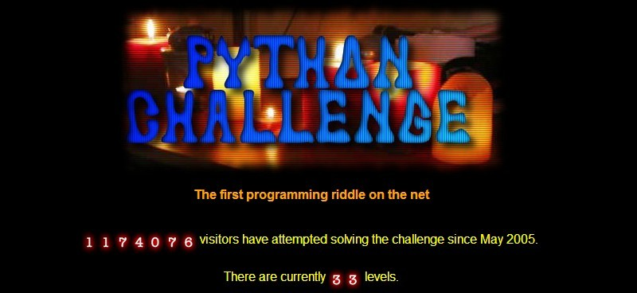

[Python Challenge](http://www.pythonchallenge.com/) 是一个非常有趣的闯关游戏，通过猜谜和编程得到关键词，并使用关键词更改网页的 URL 进入到下一关。现在共有 33 关。这篇文章（或者更多）将会专注于使用 python 和 ruby 解决这些问题。继续 python challenge 游戏。这篇文章将努力更新到 23 题。



## 第 13-17 题

剩下的题目官方的答案和网上的答案都越来越少了，果然能坚持下来的人不多啊，希望我能坚持下来吧。

### 第 13 题

数字 5 的地方可以点击，进去后告诉我们这个 xml 有问题。我对于 xml 不是很熟，搜索得知，需要用到 XML-RPC。在 python 文档里是这样介绍的：

> XML-RPC is a Remote Procedure Call method that uses XML passed via HTTP as a transport. With it, a client can call methods with parameters on a remote server (the server is named by a URI) and get back structured data. This module supports writing XML-RPC client code; it handles all the details of translating between conformable Python objects and XML on the wire.

提示：这里需要用到 12 题的 evil: Bert。打电话给它吧！

```python
# python
import xmlrpclib
xmlrpclib.ServerProxy('http://www.pythonchallenge.com/pc/phonebook.php').phone('Bert')
```

```ruby
# ruby
require "xmlrpc/client"
phonebook = XMLRPC::Client.new("www.pythonchallenge.com", "/pc/phonebook.php").proxy
puts phonebook.phone('Bert')
```

### 第 14 题

title 是 walk around，图片是绕来绕去的翔一样的面包，下面是由原始图片为`10000*1`组成的`100*100`的图片，源码里还告诉我们 10000=100+99+99+98+…

提示：将这张`10000*1`的图片按照面包那样绕来绕去的方式重新组成一张`100*100`的图片。

```python
# python
from PIL import Image
im=Image.open(r'wire.png')
new=Image.new(im.mode,[100,100])
l = [[i, i - 1 , i - 1, i - 2] for i in range(100, 1, -2)]
tmp=tmp1=0
for n,data in enumerate(l):
  for dn,dd in enumerate(data):
      tmp=tmp1
      tmp1+=dd
      if(dn==0):
          direc=(n,99-n)
      elif(dn==1):
          direc=(99-n,n)
      elif(dn==2):
          direc=(n,n)
      else:
          direc=(n,n+1)
      new.paste(im.crop((tmp,0,tmp1,1)).rotate(90*dn),direc)
new.rotate(180).show()
```

```ruby
# ruby
require 'RMagick'
input = Magick::ImageList.new("wire.png")
output = Magick::Image.new(100, 100)
l = 0
((1..99).step 2).reverse_each do |i|
  x = 50 - (i + 1) / 2
  p = input.get_pixels(l , 0, i+1, 1)
  output.store_pixels(99-x, x, 1, i+1, p)
  l += i+1
  p = input.get_pixels(l, 0, i, 1)
  output.store_pixels(x, 99-x, i, 1, p.reverse)
  l += i
  p = input.get_pixels(l, 0, i, 1)
  output.store_pixels(x, x, 1, i, p.reverse)
  l += i
  p = input.get_pixels(l, 0, i-1, 1)
  output.store_pixels(x+1, x, i-1, 1, p)
  l += i-1
end
output.display
```

### 第 15 题

差点做出来了……根据如下条件找出合适的年份：1**6 年 1 月 26 日是星期一，且该年是闰年（注意右下角的前后年份，二月份有29天）。然后就迷茫了。

根据源码的提示，第二小的人，且重要时间是 1 月 27 日（这一点一直没注意到，标了 TODO 我以为和下一题有关呢）。
提示：符合要求的年份中第二大的那一年 1 月 27 日，[莫扎特](http://en.wikipedia.org/wiki/Wolfgang_Amadeus_Mozart)诞生了。

```python
# python
from calendar import *
[i for i in range(1006,2000,10) if(isleap(i) and weekday(i, 1, 1)==3)]
#result: [1176, 1356, 1576, 1756, 1976]
```

```ruby
# ruby
require "date"
(1006..1996).step(10) do |i|
  t = Date::new i,1,26
  puts i if t.monday? && t.leap?
end
```

### 第 16 题

这题看了好多解释才明白……我们很容易注意到图中很多的奇怪的粉色线条。Title 则是：“Let me get this straight”，也就是说，我们要把这所有粉色的线条对齐成一条直线……（按行对齐，对齐成一列）

提示：好吧，我是没想到还可以这样搞……不过即使知道方法，要解决它还是需要花费些功夫的。方法有两种，一种是使用自带的图像库，按照要求移动每一行子图，然后拼接成一幅图。二是将图像转成字符串，然后按照要求移动字符串。ps: 调用 PhotoShop 或 GIMP 的颜色表，可以知道粉色的索引值是 195。

```python
# python
# 移动子图法
import Image, ImageChops
im = Image.open("mozart.gif")
c, r = im.size
for i in range(r):
    box = 0, i, c, i+1
    row = im.crop(box)
    rowstr = row.tostring()
    index = rowstr.index(chr(195))
    im.paste(ImageChops.offset(row, -index), box)
im.show()
```

```python
# -*- coding: utf-8 -*-
# 这里的编码声明很重要，必不可少
# python
# 移动字符串法
import Image, re
im = Image.open("mozart.gif")
c, r = im.size
imstr = im.tostring()
# 重新按行整理 image string
imstr = "\n".join([imstr[i*c:(i+1)*c] for i in xrange(r)])
magic = chr(195)
imstr = re.compile(r"^(.*?)(%s{5}.*?)$"%magic, re.M).sub(r"\2\1", imstr).replace("\n","")
im.fromstring(imstr)
im.show()
```

```ruby
# ruby
# 移动子图法
require 'RMagick'
im = Magick::ImageList.new("mozart.gif")
r, c = im.rows, im.columns
MARKER = Magick::Pixel.new(red=65535, green=0, blue=65535, opacity=0)
r.times do |y|
  rowp = im.get_pixels(0,y,c,1)
  i = rowp.index MARKER
  im.store_pixels(0,y,c,1, rowp[i..c]+rowp[0..i])
end
im.display
```

```ruby
# ruby
# 移动字符串法
require 'RMagick'
im = Magick::ImageList.new("mozart.gif")
c, r = im.columns, im.rows
magic = [255,0,255].map{|i| i.chr}.join
r.times do |y|
  tmp = im.export_pixels_to_str 0,y,c,1
  idx = tmp.index magic
  tmp = tmp[idx..-1]+tmp[0,idx]
  im.import_pixels 0,y,c,1,"RGB",tmp
end
im.display
```

### 第 17 题

你要是战线拉得很长的话，这一题几乎不能自己做出来……谁能想到那张小图片是第几题的啊！好吧，这一题 title 问你吃什么，图片的名字叫 cookies，那么应该就是和 cookie 有关了，然后你得根据小图的信息，回到第 4 题的地方……好吧，回到第 4 题后，我们在 cookie 里看到，我们需要把曾经的 nothing 改成 busynothing，稍微试试不同的数字，能发现大概是让我们收集 cookie 里的字符。

提示：这一题共有三个步骤：

1. 看网页的源码，改成 busynothing 之后 set-cookie 接连是 B 和 Z，所以，跟踪 busynothing 的数字，得到一段由 Bzip2 压缩的字符串。解压之，得到一段有意义的话。让我们给他的父亲打电话。
2. 回到第 13 题，打电话给 [Leopold](http://en.wikipedia.org/wiki/Leopold_Mozart)（Mozart 的父亲），根据得到的字符串跳转网址。
3. 给该网址设置 cookie：info=****，info 的内容就是第一步得到的内容。

```python
# python
# step 1
import urllib,re,bz2
url  = 'http://www.pythonchallenge.com/pc/def/linkedlist.php?busynothing='
seed = "12345"
info = ''
while True:
    req  = urllib.urlopen(url+seed)
    text = req.read()
    seed = ''.join(re.findall(r"busynothing is (\d+)",text))
    cookies = req.info().getheaders('Set-Cookie')[0]
    byte = cookies.split(';')[0].split('=')[1]
    info += byte
    try :
        int(seed)
        print "   Info:",byte,"  the Next seed:",seed
    except :
        print "   Info:",byte,"  the Last seed:",text
        break
print "info:", bz2.decompress(urllib.unquote_plus(info))

# step 2
import xmlrpclib
phonebook = xmlrpclib.ServerProxy('http://www.pythonchallenge.com/pc/phonebook.php')
print phonebook.phone('Leopold')

# step 3
from urllib2 import Request,urlopen
from urllib import quote_plus
info = "the flowers are on their way"
url = "http://www.pythonchallenge.com/pc/stuff/violin.php"
req = Request(url, headers={'Cookie': 'info=' + quote_plus(info)})
print urlopen(req).read()
```

```ruby
# ruby
# first step
require "open-uri"
require "cgi"
require "bzip2"
pre = "http://www.pythonchallenge.com/pc/def/linkedlist.php?busynothing="
num = 12345
output = ''
loop do
  flag = false
  open "#{pre}#{num}" do |f|
    num = f.read.scan(/\d+{2,6}/).first
    ch = f.meta["set-cookie"].split(";").first.split("=")[1]
    print "The seed is #{num}, and the char is #{ch}\n"
    flag = true if num.nil?
    output << ch
  end
  break if flag
end
puts Bzip2.uncompress CGI.unescape(output)

# second step
require "xmlrpc/client"
phonebook = XMLRPC::Client.new("www.pythonchallenge.com", "/pc/phonebook.php").proxy
puts phonebook.phone('Leopold')

# third step
require "open-uri"
message = "the flowers are on their way"
url = "http://www.pythonchallenge.com/pc/stuff/violin.php"
puts open(url,"Cookie"=>"info="+CGI.escape(message)).read
```

## 第 18-23 题

### 第 18 题

看源码，让我们找出图片的区别。一眼能看出来是亮度不同，于是逐一试验：dark, darkness, bright, brightness。Got it! 

```html
<!-- maybe consider deltas.gz -->
```

什么意思呢？把 url 改成这个，即可下载该 gz 文件。解压之，是个纯文本文件。粗略看一下，应该是左右两个文件。分开，求 diff，观察。