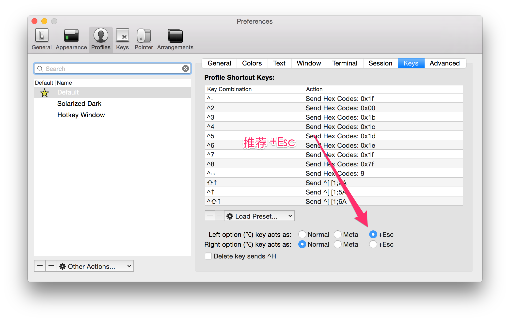
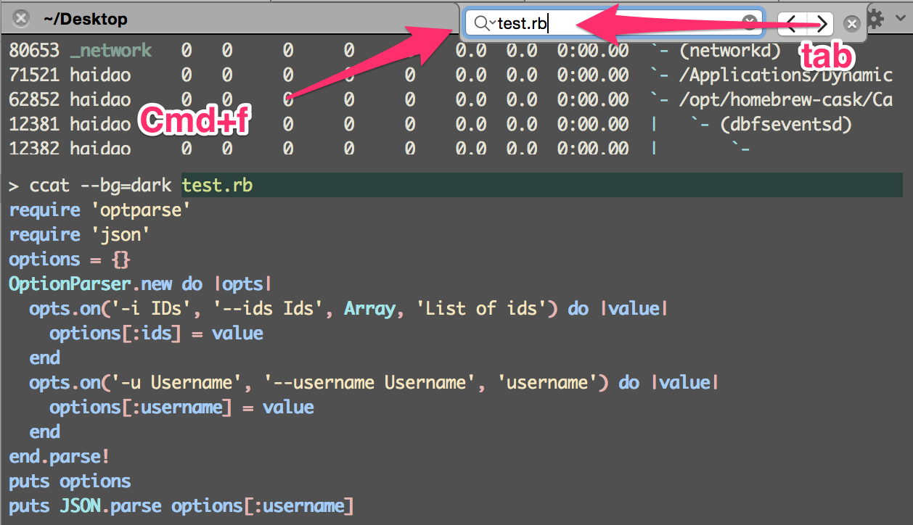
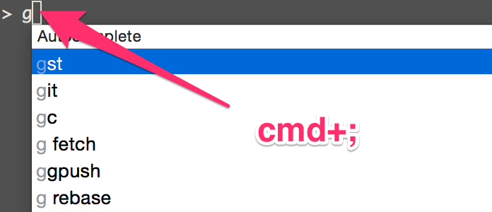
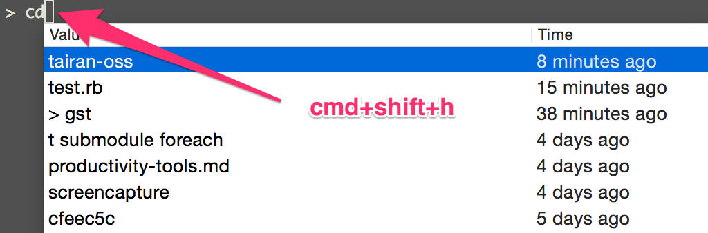
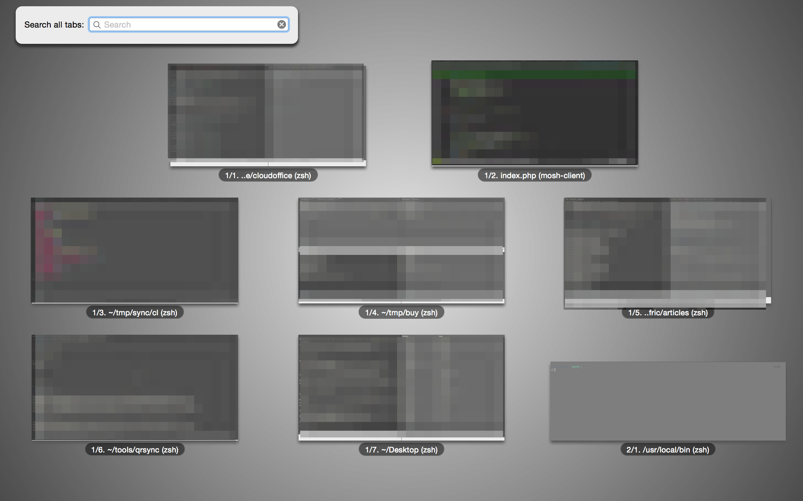
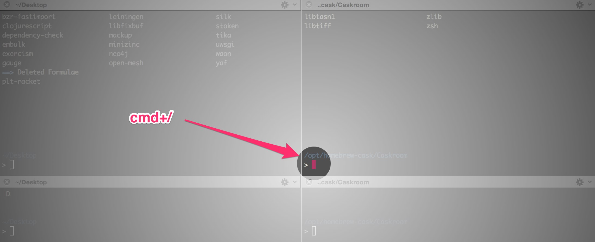
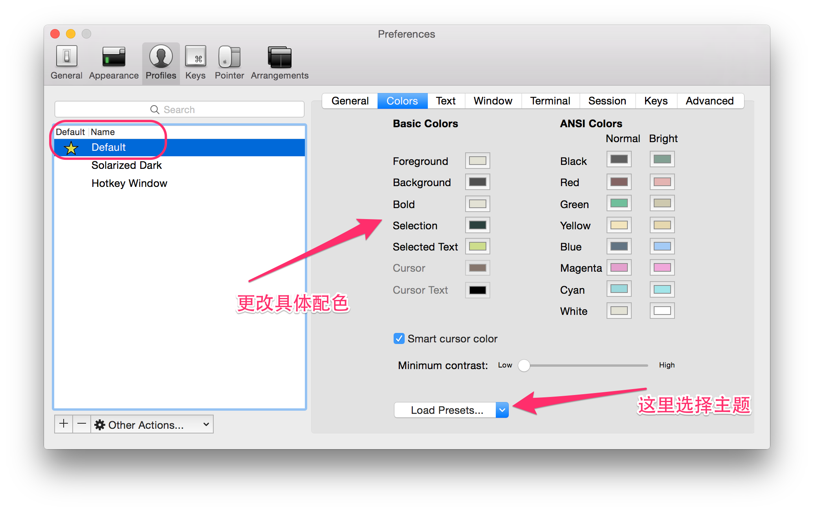
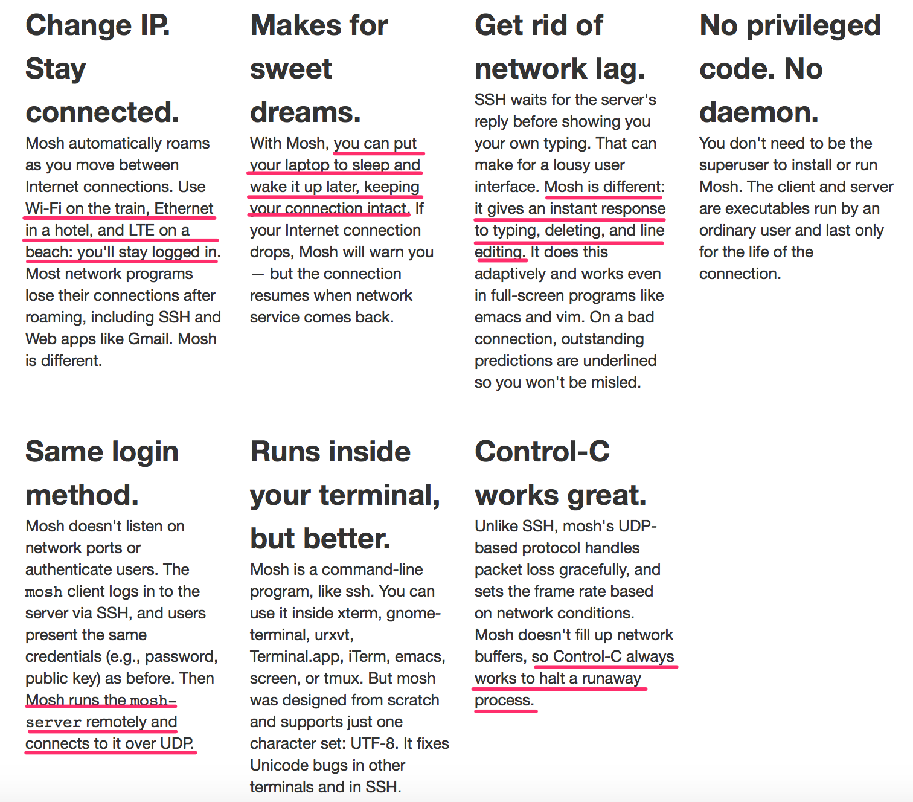

## iTerm2

[iTerm2](https://iterm2.com/) 是 MAC 下最好的终端工具。可以简单的认为，iTerm2 是配置完毕开箱即用的 tmux。但 tmux 有以下一些缺点：

- 查找 terminal 的输出历史内容需要切换到 vim 模式。在该模式下复制使用的是 vim 的查找，增加了认知负担；
- 和各种工具兼容性比较差，尤其是 vim 和 emacs 的 powerline；
- 自有样式，与系统的样式冲突。

iTerm2 的一些特色功能如下：

### 标签变色

iTerm2 的标签的颜色会变化，以指示该 tab 当前的状态。当该标签有新输出的时候，标签会变成洋红色；新的输出长时间没有查看，标签会变成红色。可在设置中关掉该功能。

### 智能选中

在 iTerm2 中，双击选中，三击选中整行，四击智能选中（智能规则可[配置](http://www.iterm2.com/documentation-smart-selection.html)），可以识别网址，引号引起的字符串，邮箱地址等。（很多时候双击的选中就已经很智能了）

在 iTerm2 中，选中即复制。即任何选中状态的字符串都被放到了系统剪切板中。

### 巧用 Command 键

按住⌘键:

- 可以拖拽选中的字符串；
- 点击 url：调用默认浏览器访问该网址；
- 点击文件：调用默认程序打开文件；
- 如果文件名是`filename:42`，且默认文本编辑器是 `Macvim`、`Textmate`或`BBEdit`，将会直接打开到这一行；
- 点击文件夹：在 finder 中打开该文件夹；
- 同时按住`option`键，可以以矩形选中，类似于`vim`中的`ctrl v`操作。

### Meta 键

在`emacs`中，`meta`键的使用非常频繁，而 OSX 系统没有提供`meta`键。在 iTerm2 中可以选择左右两个的`Option`键作为`meta`键。官方推荐的配置如下图所示。右`Option`键依然是 OSX 的默认功能（输入特殊字符）。



```
Q: How do I make the option/alt key act like Meta or send escape codes?

A: Go to Preferences->Profiles tab. Select your profile on the left, and then open the Keyboard tab. At the bottom is a set of buttons that lets you select the behavior of the Option key. For most users, Esc+ will be the best choice.
```

### 常用快捷键

- 切换 tab：⌘+←, ⌘+→, ⌘+{, ⌘+}。⌘+数字直接定位到该 tab；
- 新建 tab：⌘+t；
- 顺序切换 pane：⌘+[, ⌘+]；
- 按方向切换 pane：⌘+Option+方向键；
- 切分屏幕：⌘+d 水平切分，⌘+Shift+d 垂直切分；
- 智能查找，支持正则查找：⌘+f。



### 自动完成

iTerm2 可以自动补齐命令，输入若干字符，按`⌘+;`弹出自动补齐窗口，列出曾经使用过的命令。



iTerm2 也可以使用历史记录，按`⌘+Shift+h`弹出历史粘贴记录窗口，`⌘+Shift+;`弹出历史命令记录窗口。



### Exposé Tabs

`⌘+Option+e`全屏展示所有的 tab，可以搜索。



### 高亮当前鼠标的位置

一个标签页中开的窗口太多，有时候会找不到当前的鼠标，`⌘+/`找到它。



### 配色

你可以自由定制喜欢的配色，[这里](http://iterm2colorschemes.com/) 收集了大量 iTerm2 的主题，你可以选择使用。我用的是`Zenburn`。在其 github repo 里下载对应的`xxx.itermcolors`文件，双击安装使用。



## mosh

[mosh](https://mosh.mit.edu/) 是全平台更好的 ssh 工具，更健壮，支持断续连接，支持除了 iPhone 之外的几乎任何平台。（iOS 让人爱不释手的优点，也正是它让人恨之入骨的缺点）

在 OSX 下安装`brew install mobile-shell`，其他平台请参考官方[教程](https://mosh.mit.edu/#getting)。



从上面来看，mosh 最主要的优点就是，断网了，休眠了，mosh的连接不会断。亲测一个 mosh 连接开了几个月一直没断。
