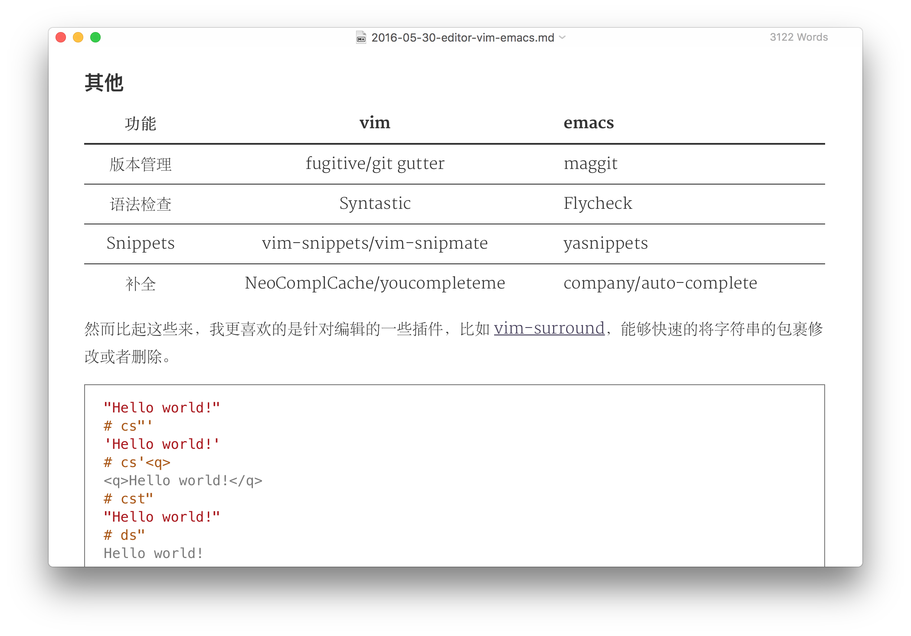
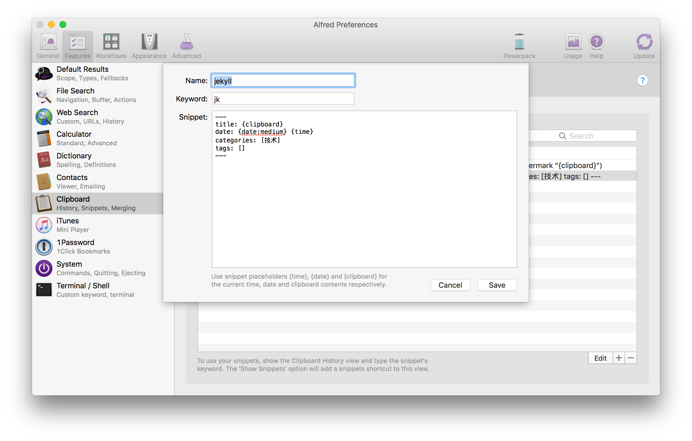
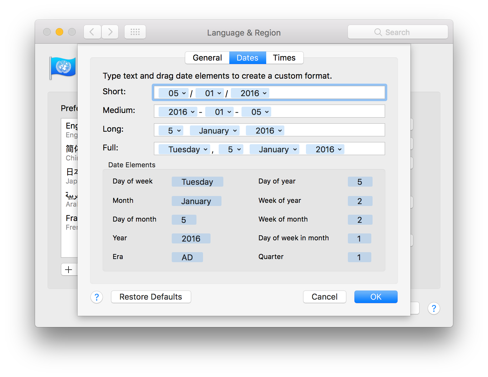

从开博客以来渐渐写了不少文字，此文用以记录这一过程中积累的一些写作工具。

## 卡片式写作

我们写作的时候并非总是线性的工作方式。经常情况是，对某个主题突然有了一个灵感，然后把它记下来，这样一些灵感堆积在一起，就可以组织成一篇文章了。即使已经有了一些灵感，在写作的时候，也并非从开头写到结尾，通常我们会从顺手的先写起。

此外，王小波曾经在「用一生来学习艺术」中提到，

> 我对这件事很有把握，是因为我也这样写过：把小说的文件调入电脑，反复调动每一个段落，假如原来的小说足够好的话，逐渐就能找到这种线索；花上比写原稿多三到五倍的时间就能得到一篇新小说，比旧的好得没法比。事实上，「情人」也确实是这样改过，一直改到改不动，才交给出版社。
>

在写完之后，再局部调动段落的顺序，有时可能有意想不到的奇妙之处。

这以上种种都说明，既然写作在某种情况下拥有非线性的特质，那么按照非线性的方式来写作就值得我们尝试。

其中一种有效的非线性写作方式就是[纳博科夫的卡片](http://www.yangzhiping.com/psy/nabokov.html)。在这篇文章中提到了一个极为优秀的写作软件[scrivener](https://www.literatureandlatte.com/scrivener.php)。该软件可以说是大型写作软件中最好的一个了，它的卡片模式非常舒服。但是价格偏高，Windows，MacOS 和 iOS 三个版本分别收费。而且，对于写博客文章来说，也有些大材小用了。

我目前的方法是使用苹果自带的 Notes。主要是……免费，而且轻量，便携。设备自带，打开速度也快，非常适合在草稿阶段随时记录。缺点就是不好实现卡片式写作，草稿的收集过程更像是在一个文件中不停的 append，而不是管理卡片。近期在尝试的一个工具是 [workflowy](https://workflowy.com/)，它在管理上比较符合卡片的理念，但缺点是，这个软件在设计上应该是一个 TODO 类或者说知识管理的软件，缺乏卡片视图。

当素材积累完成时，便可以打开 [typora](https://www.typora.io/) 开始写了。



## 图片同步

使用 markdown 写作的一个劣势是图片处理很麻烦。在 office 中，可以直接复制粘贴，但是纯文本文件不行，必须指定实体图片的具体位置才可以。对于截图来说，将不得不增加一个实体化存储的过程。有些程序员开发了一些小工具来简化这一过程，比如 mweb，ipic 等。

我是用的七牛云自带的图片同步工具 [qrsync](http://o9gnz92z5.bkt.clouddn.com/code/v6/tool/qrsync.html)。这个工具已经废弃了，那么大家就换 [qshell](http://o9gnz92z5.bkt.clouddn.com/code/v6/tool/qshell.html) 好了。我用 qrsync 还挺好的，就不打算换了。这个工具在执行的时候会比较指定的文件夹和七牛云上的 bucket 的内容，然后将新的文件上传。我就是用这个工具来同步图片的，每当制作了一个新图就放到这个文件夹内，然后执行同步。

在 shell 下执行同步的输出如下：

```shell
2016/09/23 00:13:05.006800 INFO qrsync.go:49: Syncing /Users/username/images => your_bucket_name

2016/09/23 00:13:05.011035 INFO qrsync.go:83: Processing file: /Users/username/.qrsync/xxx.log

2016/09/23 00:13:05.422698 INFO sync.go:100: Put /Users/username/images/alfred/jekyll-title.png => your_bucket_name:alfred/jekyll-title.png

2016/09/23 00:13:05.455394 INFO sync.go:59: Sync done!
```

图片上传完毕后，我们还需要插入地址，我写了一个 alfred 的 snippet 来获取 url。在 alfred 的 Features 标签页中，选择 Clipboard，添加如下的 snippet：

```shell

```
我只需要复制alfred/jekyll-title.png，然后选择该 snippet，即可得到需要的 markdown 地址格式。

## 其他

### Jekyll 头信息

我用的是 Jekyll 博客程序，要求每篇文章都要有头信息，包括 title, date, categories, tags 等。每次都写会很麻烦，便在如下位置添加了一个 snippet：



其内容如下：

```bash
---
title: {clipboard}
date: {date:medium} {time}
categories: [技术]
tags: []
---
```
这样每次调出这个 snippet 即可。

PS：这里的 date 和 time 是操作系统所支持的，可以在系统设置->时间和日期设置->语言和时区->高级设置中查看。其中 {date:xxx} 后面的内容和 dates 中的一一对应。



### Jekyll 部署

[旧文](/2014/09/jekyll-plugs/)中曾提及，我使用 Jekyll 的方式和 octopress 很像，都是一个分支保存 source，一个分支用来部署。为了简化这一过程，我写了一个 script 脚本，`_deploy.sh`（下划线开头的文件不会被转换到 site 中去）。

```bash
#!/bin/sh
git submodule foreach git pull # 我把文章 source 抽成一个 repo 了
jekyll b # jekyll build
cd _site # site 中是部署的代码，分支是 master；外层分支是 source
git add .
now="$(date +"%Y-%m-%d %H:%M")"
git commit -m "${now}"
git push origin master
```

这样每次写好文章之后，执行`sh _deploy.sh`即可。
