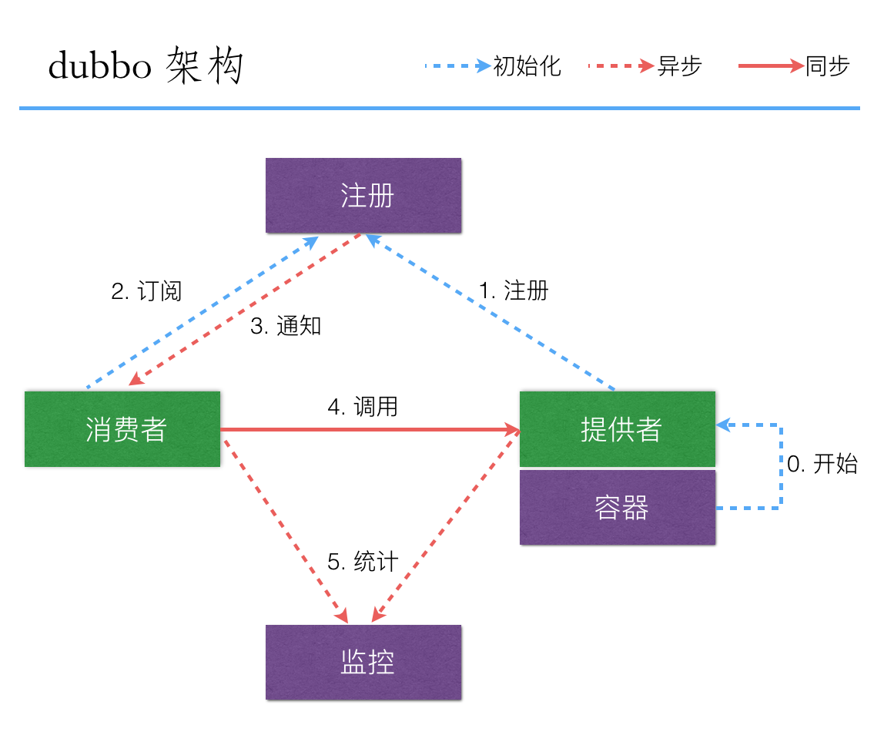
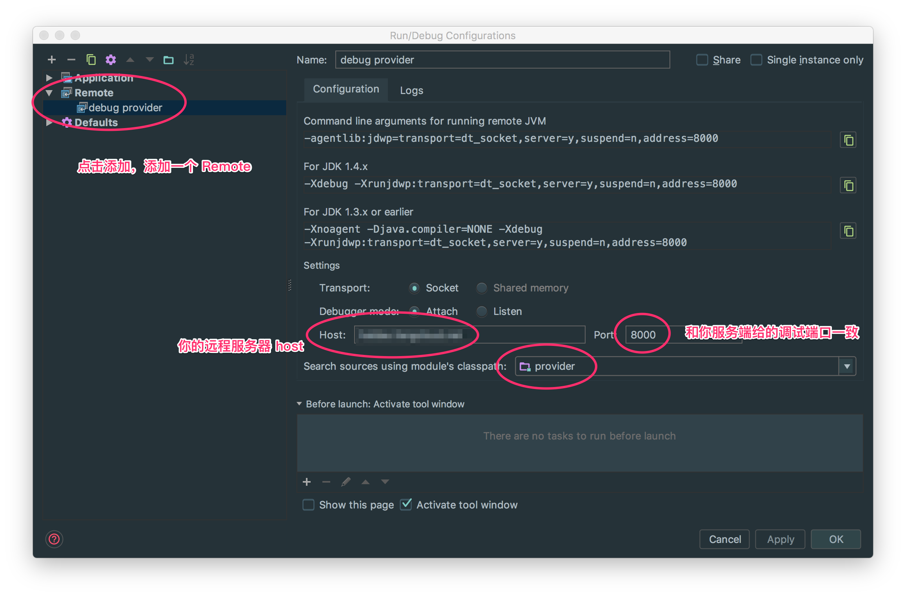

这篇文章将简单的介绍如何写一个 dubbo 服务。dubbo 的准备工作请参照[前文](/2017/03/intro-dubbo/)。



从此图可知，当注册中心和监控已经工作起来之后，我们需要写的就是消费方和服务方的代码了。一个简单的一对一提供服务的代码结构如下[^1]：

```shell
~/IdeaProjects/dubbox/dubbo-demo master
> ls
dubbo-demo-api      dubbo-demo-provider pom.xml
dubbo-demo-consumer dubbo-demo.iml
```

其中 api 部分定义了 provider 和 consumer 都需要用到的接口，这样 provider 实现这些接口，consumer 就可以像本地调用一样来调用这些接口了。

## 接口定义与步骤

该 dubbo 服务将实现获取权限数组的功能，即调用`PermissionService.getPermissions`获取权限数组。在本文的例子中，我们将实现 1) 直接返回字符串的数组；2) 返回 java 对象（POJO） 的  json/xml 序列化的结果。

```shell
# 直接返回字符串的数组
['permission_1', 'permission_2', 'permission_3']
# 返回 json/xml 序列化的结果
[
	{
      "id": 1,
      "name": "x1_permission",
	},
	{
      "id": 2,
      "name": "x2_permission",
	}
]
```

### 协议分类

dubbo 的服务方和提供方通信支持多种协议，默认的是 dubbo 协议。官方给出的协议建议为：

| 协议      | 优势                                       | 劣势                         |
| ------- | ---------------------------------------- | -------------------------- |
| Dubbo   | 采用NIO复用单一长连接，并使用线程池并发处理请求，减少握手和加大并发效率，性能较好（推荐使用） | 在大文件传输时，单一连接会成为瓶颈          |
| Rmi     | 可与原生RMI互操作，基于TCP协议                       | 偶尔会连接失败，需重建Stub            |
| Hessian | 可与原生Hessian互操作，基于HTTP协议                  | 需hessian.jar支持，http短连接的开销大 |

除此之外，当当还通过扩展 dubbo 得到 dubbox，支持了 HTTP 的 Rest 接口。关于 Rest 的优缺点参见 dubbox 的[介绍](https://dangdangdotcom.github.io/dubbox/rest.html)。本文使用的就是 dubbox。

### 步骤

我们将循序渐进的实现一个获取权限数组的服务。代码最终结果在 [wwulfric/dubbodemo](https://github.com/wwulfric/dubbodemo/)。

1. 通过 dubbo 协议实现获取权限数组的服务
2. 通过 rest 规范实现获取权限数组的服务
3. 将提供方以服务的形式部署到服务器

## dubbo 协议简例

代码参见 [protocol/dubbo 分支](https://github.com/wwulfric/dubbodemo/tree/protocol/dubbo)。

创建 maven 项目 dubbo-test，编辑 pom 文件，并仿照官方示例，在 maven 项目下分别创建 3 个 module：api, provider 和 consumer。

```xml
<!-- dubbo test 的 pom 文件直接用默认生成的即可 -->
<?xml version="1.0" encoding="UTF-8"?>
<project xmlns="http://maven.apache.org/POM/4.0.0"
         xmlns:xsi="http://www.w3.org/2001/XMLSchema-instance"
         xsi:schemaLocation="http://maven.apache.org/POM/4.0.0 http://maven.apache.org/xsd/maven-4.0.0.xsd">
    <modelVersion>4.0.0</modelVersion>
    <groupId>dubbotest</groupId>
    <artifactId>dubbotest</artifactId>
    <version>1.0-SNAPSHOT</version>
</project>
```

### 创建 api module

通过 IDE 创建 api 子模块（或者手动创建文件夹），并创建 api.PermissionService 类：

```java
package api;
import java.util.List;
public interface PermissionService {
    List<String> getPermissions(Long id);
}
```

文件夹结构如下：

```
.
├── api
│   ├── pom.xml
│   └── src
│       ├── main
│       │   ├── java
│       │   │   └── api
│       │   │       └── PermissionService.java
│       │   └── resources
│       └── test...
├── pom.xml
└── src...
```

### 创建 provider module

用同样的方式创建子模块，并编辑 pom 文件，引入 dubbo 等必要的依赖包：

```xml
...
    <dependencies>
        <!-- 引入 api，在 provider 中实现 api 定义的接口 -->
        <dependency>
            <groupId>dubbotest</groupId>
            <artifactId>api</artifactId>
            <version>1.0-SNAPSHOT</version>
        </dependency>
        <!-- 引入 dubbo -->
        <dependency>
            <groupId>com.alibaba</groupId>
            <artifactId>dubbo</artifactId>
            <version>2.8.4</version>
        </dependency>
        <!-- 引入 log4j -->
        <dependency>
            <groupId>log4j</groupId>
            <artifactId>log4j</artifactId>
            <version>1.2.17</version>
        </dependency>
        <!-- 引入 zookeeper client -->
        <dependency>
            <groupId>com.github.sgroschupf</groupId>
            <artifactId>zkclient</artifactId>
            <version>0.1</version>
        </dependency>
    </dependencies>
...
```

阿里的 Dubbo 框架已经集成了 Zookeeper、Spring 等框架的依赖，但是有一个例外就是 zkclient，如果没有引用将会抛出如下异常信息：

```
Exception in thread "main" java.lang.NoClassDefFoundError: org/I0Itec/zkclient/exception/ZkNoNodeException
...
```

创建 provider.DemoProvider 类：

```java
package provider;
import java.io.IOException;
public class DemoProvider {
    public static void main(String[] args) throws IOException {
      	// 如果 spring 配置文件的位置是默认的，则可以直接这样启动服务
        com.alibaba.dubbo.container.Main.main(args);
    }
}
```

如果 spring 配置文件在默认的 resources/META-INF/spring 下，则可以直接这样启动服务，否则需要声明指定其位置：

```java
// 建议使用上一种方法
package provider;
import org.springframework.context.support.ClassPathXmlApplicationContext;
import java.io.IOException;
public class DemoProvider {
    public static void main(String[] args) throws IOException {
        ClassPathXmlApplicationContext context = new ClassPathXmlApplicationContext("classpath*:META-INF/spring/*.xml");
        System.out.println(context.getDisplayName() + ": here");
        context.start();
        System.out.println("服务已经启动...");
        System.in.read();
    }
}
```

创建 api 中定义 api.PermissionService 接口的实现类 provider.PermissionServiceImpl：

```java
package provider;
import api.PermissionService;
import java.util.ArrayList;
import java.util.List;
public class PermissionServiceImpl implements PermissionService {
    public List<String> getPermissions(final Long id) {
      	// 该函数应该实现 getPermissions 的业务逻辑，这里简单返回一个 list
        List<String> permissions = new ArrayList<String>();
      	permissions.add(String.format("Permission_%d", id - 1));
      	permissions.add(String.format("Permission_%d", id));
      	permissions.add(String.format("Permission_%d", id + 1));
        return permissions;
    }
}
```

创建 spring 配置文件，重点是 dubbo 相关服务的配置：

```xml
<?xml version="1.0" encoding="UTF-8"?>
<beans xmlns="http://www.springframework.org/schema/beans"
       xmlns:xsi="http://www.w3.org/2001/XMLSchema-instance"
       xmlns:dubbo="http://code.alibabatech.com/schema/dubbo"
       xsi:schemaLocation="http://www.springframework.org/schema/beans
       http://www.springframework.org/schema/beans/spring-beans.xsd
       http://code.alibabatech.com/schema/dubbo
       http://code.alibabatech.com/schema/dubbo/dubbo.xsd">
    <!--定义了提供方应用信息，用于计算依赖关系；在 dubbo-admin 或 dubbo-monitor 会显示这个名字，方便辨识-->
    <dubbo:application name="demotest-provider" owner="programmer" organization="dubbox"/>
    <!--使用 zookeeper 注册中心暴露服务，注意要先开启 zookeeper-->
    <dubbo:registry address="zookeeper://localhost:2181"/>
    <!-- 用dubbo协议在20880端口暴露服务 -->
    <dubbo:protocol name="dubbo" port="20880" />
    <!--使用 dubbo 协议实现定义好的 api.PermissionService 接口-->
    <dubbo:service interface="api.PermissionService" ref="permissionService" protocol="dubbo" />
    <!--具体实现该接口的 bean-->
    <bean id="permissionService" class="provider.PermissionServiceImpl"/>
</beans>
```

最后，在 resources 目录下创建 log4j 的配置文件：

```xml
<?xml version="1.0" encoding="UTF-8"?>
<!DOCTYPE log4j:configuration SYSTEM "log4j.dtd">
<log4j:configuration xmlns:log4j="http://jakarta.apache.org/log4j/" debug="false">
    <appender name="CONSOLE" class="org.apache.log4j.ConsoleAppender">
        <layout class="org.apache.log4j.PatternLayout">
            <param name="ConversionPattern" value="[%d{dd/MM/yy hh:mm:ss:sss z}] %t %5p %c{2}: %m%n" />
        </layout>
    </appender>
    <root>
        <level value="INFO" />
        <appender-ref ref="CONSOLE" />
    </root>
</log4j:configuration>
```

文件创建完毕，接下来在根目录下执行`mvn clean package`，然后执行 provider.DemoProvider 的 main 函数，即可启动该服务了。查看 monitor/admin，看我们定义的 demotest-provider 这个名称的提供者是否出现在服务列表中；或者在 console 输出中发现如下信息，即表示成功启动：

```
...
[05/03/17 11:56:43:043 CST] main  INFO container.Main:  [DUBBO] Dubbo SpringContainer started!, dubbo version: 2.8.4, current host: 127.0.0.1
[2017-03-05 23:56:43] Dubbo service server started!
```

provider 的文件结构如下：

```
.
├── pom.xml
├── src
│   ├── main
│   │   ├── java
│   │   │   └── provider
│   │   │       ├── DemoProvider.java
│   │   │       └── PermissionServiceImpl.java
│   │   └── resources
│   │       ├── META-INF
│   │       │   └── spring
│   │       │       └── dubbotest-provider.xml
│   │       └── log4j.xml
│   └── test...
└── target...
```

### 创建 consumer module

consumer 子模块的创建和 provider 很像。pom 文件：

```xml
    <dependencies>
        <dependency>
            <!-- 引入 api，在 consumer 中调用 api 定义的接口 -->
            <groupId>dubbotest</groupId>
            <artifactId>api</artifactId>
            <version>1.0-SNAPSHOT</version>
        </dependency>
        <dependency>
            <groupId>com.alibaba</groupId>
            <artifactId>dubbo</artifactId>
            <version>2.8.4</version>
        </dependency>
        <dependency>
            <groupId>log4j</groupId>
            <artifactId>log4j</artifactId>
            <version>1.2.17</version>
        </dependency>
        <dependency>
            <groupId>com.github.sgroschupf</groupId>
            <artifactId>zkclient</artifactId>
            <version>0.1</version>
        </dependency>
    </dependencies>
```

创建 spring 配置文件：

```xml
<?xml version="1.0" encoding="UTF-8"?>
<beans xmlns="http://www.springframework.org/schema/beans"
       xmlns:xsi="http://www.w3.org/2001/XMLSchema-instance"
       xmlns:dubbo="http://code.alibabatech.com/schema/dubbo"
       xsi:schemaLocation="http://www.springframework.org/schema/beans http://www.springframework.org/schema/beans/spring-beans.xsd
       http://code.alibabatech.com/schema/dubbo http://code.alibabatech.com/schema/dubbo/dubbo.xsd">
    <dubbo:application name="demotest-consumer" owner="programmer" organization="dubbox"/>
  	<!--向 zookeeper 订阅 provider 的地址，由 zookeeper 定时推送-->
    <dubbo:registry address="zookeeper://localhost:2181"/>
    <!--使用 dubbo 协议调用定义好的 api.PermissionService 接口-->
    <dubbo:reference id="permissionService" interface="api.PermissionService"/>
</beans>
```

创建 consumer.DemoConsumer 类：

```java
package consumer;
import api.PermissionService;
import org.springframework.context.support.ClassPathXmlApplicationContext;
public class DemoConsumer {
    public static void main(String[] args) {
        //测试常规服务
        ClassPathXmlApplicationContext context = new ClassPathXmlApplicationContext("classpath*:META-INF/spring/*.xml");
        context.start();
        PermissionService permissionService = context.getBean(PermissionService.class);
        System.out.println(permissionService.getPermissions(1L));
    }
}
```

log4j 配置相同。

执行`mvn clean package`，然后执行 consumer.DemoConsumer 的 main 函数，即可启动该服务了。查看 monitor/admin，看我们定义的 demotest-consumer 这个名称的提供者是否出现在服务列表中；或者在 console 输出中发现如下信息，即表示成功启动（输出的数组即为调用的结果）：

```
...
[Permission_0, Permission_1, Permission_2]
```

可见，在 consumer 中调用 provider 的实现，代码上看起来和本地调用一样，即 provider 相对于 consumer 来说是透明的。

consumer 文件结构如下：

```
.
├── pom.xml
├── src
│   ├── main
│   │   ├── java
│   │   │   └── consumer
│   │   │       └── DemoConsumer.java
│   │   └── resources
│   │       ├── META-INF
│   │       │   └── spring
│   │       │       └── dubbotest-consumer.xml
│   │       └── log4j.xml
│   └── test...
└── target...
```

## dubbo rest 接口

代码参见 [protocol/rest 分支](https://github.com/wwulfric/dubbodemo/tree/protocol/rest)。

需要在 api 中定义 rest 接口，并在 provider 中实现这个接口。

### api module

添加 api.PermissionRestService 类：

```java
package api;
import javax.validation.constraints.Min;
import java.util.List;
public interface PermissionRestService {
    List<String> getPermissions(@Min(value = 1L, message = "User ID must be greater than 1") Long id);
}
```

pom 文件添加依赖：

```xml
        <dependency>
            <groupId>javax.validation</groupId>
            <artifactId>validation-api</artifactId>
            <version>2.0.0.Alpha1</version>
        </dependency>
```

### provider module

在 pom 文件中添加依赖：

```xml
        <!--rest 规范，比如 Get, Path, MediaType 等-->
        <dependency>
            <groupId>javax.ws.rs</groupId>
            <artifactId>javax.ws.rs-api</artifactId>
            <version>2.0.1</version>
        </dependency>
        <!--使用 netty 启动 rest 服务-->
        <dependency>
            <groupId>org.jboss.resteasy</groupId>
            <artifactId>resteasy-netty</artifactId>
            <version>3.0.7.Final</version>
        </dependency>
        <!--rest json 输出-->
        <dependency>
            <groupId>org.jboss.resteasy</groupId>
            <artifactId>resteasy-jackson-provider</artifactId>
            <version>3.0.7.Final</version>
        </dependency>
        <!--rest 需要的依赖-->
        <dependency>
            <groupId>org.jboss.resteasy</groupId>
            <artifactId>resteasy-client</artifactId>
            <version>3.0.7.Final</version>
        </dependency>
        <!--验证-->
        <dependency>
            <groupId>org.hibernate</groupId>
            <artifactId>hibernate-validator</artifactId>
            <version>4.2.0.Final</version>
        </dependency>
        <!--slf4j 和其依赖-->
        <dependency>
            <groupId>org.slf4j</groupId>
            <artifactId>slf4j-api</artifactId>
            <version>1.7.5</version>
        </dependency>
        <dependency>
            <groupId>org.slf4j</groupId>
            <artifactId>slf4j-log4j12</artifactId>
            <version>1.7.5</version>
        </dependency>
```

其中 slf4j 的问题参见 [stackoverflow](http://stackoverflow.com/questions/7421612/slf4j-failed-to-load-class-org-slf4j-impl-staticloggerbinder)。

创建 provider.PermissionRestServiceImpl 实现 上面的接口：

```java
package provider;
import api.PermissionRestService;
import api.PermissionService;
import com.alibaba.dubbo.rpc.RpcContext;
import com.alibaba.dubbo.rpc.protocol.rest.support.ContentType;
import javax.servlet.http.HttpServletRequest;
import javax.servlet.http.HttpServletResponse;
import javax.ws.rs.*;
import javax.ws.rs.core.MediaType;
import java.util.List;
@Path("permissions")
@Consumes({MediaType.APPLICATION_JSON})
@Produces({ContentType.APPLICATION_JSON_UTF_8})
public class PermissionRestServiceImpl implements PermissionRestService {
    private PermissionService permissionService;

    public void setPermissionService(PermissionService permissionService) {
        this.permissionService = permissionService;
    }
    @GET
    @Path("{id : \\d+}")
    public List<String> getPermissions(@PathParam("id") Long id) {
        if (RpcContext.getContext().getRequest(HttpServletRequest.class) != null) {
            System.out.println("Client IP address from RpcContext: " + RpcContext.getContext().getRequest(HttpServletRequest.class).getRemoteAddr());
        }
        if (RpcContext.getContext().getResponse(HttpServletResponse.class) != null) {
            System.out.println("Response object from RpcContext: " + RpcContext.getContext().getResponse(HttpServletResponse.class));
        }
        // 上面是输出相应的测试信息的，真实的实现只有下面这句
        return permissionService.getPermissions(id);
    }
}
```

编辑 spring 配置：

```xml
    ...
    <!--使用 netty 服务，将 rest 服务暴露在 4567 端口-->
    <dubbo:protocol name="rest" port="4567" threads="500" contextpath="services" server="netty" accepts="500" extension="com.alibaba.dubbo.rpc.protocol.rest.support.LoggingFilter"/>
    <!--使用 rest 规范实现定义好的 api.PermissionRestService 接口-->
    <dubbo:service interface="api.PermissionRestService" ref="permissionRestService" protocol="rest"  validation="true"/>
    <!--具体实现该接口的 bean-->
    <bean id="permissionRestService" class="provider.PermissionRestServiceImpl">
        <property name="permissionService" ref="permissionService"/>
    </bean>
```

启动 DemoProvider 的 main 函数，此时输入 http://localhost:4567/services/permissions/3.json 即可访问提供者的 rest 接口了。

### consumer module

编辑 DemoConsumer 类，添加 rest 调用：

```java
public class DemoConsumer {
    public static void main(String[] args) {
        // 测试常规服务
        ClassPathXmlApplicationContext context = new ClassPathXmlApplicationContext("classpath*:META-INF/spring/*.xml");
        context.start();
        // dubbo 协议
        PermissionService permissionService = context.getBean(PermissionService.class);
        System.out.println(permissionService.getPermissions(1L));
        // rest 规范
        PermissionRestService permissionRestService = context.getBean(PermissionRestService.class);
        System.out.println(permissionRestService.getPermissions(2L));
    }
}
```

在当当的 dubbox [文档](https://dangdangdotcom.github.io/dubbox/rest.html)中，rest 调用分 3 种场景：

1. 非 dubbo 的消费端调用 dubbo 的 REST 服务（non-dubbo --> dubbo）
2. dubbo 消费端调用 dubbo 的 REST 服务 （dubbo --> dubbo）
3. dubbo的消费端调用非 dubbo 的 REST 服务 （dubbo --> non-dubbo）

我们直接通过 rest 的 uri 调用就是第 1 种，上面实现的是第 2 种。注意到第 1 种调用实际上是直接访问的地址，所以就不具备 dubbo 提供的服务发现功能了。

编辑 spring 配置，添加 permissionRestService：

```xml
    <!--使用 dubbo 协议调用定义好的 api.PermissionRestService 接口-->
    <dubbo:reference id="permissionRestService" interface="api.PermissionRestService"/>
```

执行 DemoConsumer 的 main 函数，报错：

```
java.lang.IllegalStateException: Unsupported protocol rest in notified url: ...
```

[文档](https://dangdangdotcom.github.io/dubbox/rest.html)中指明，这种调用方式必须把 JAX-RS 的 annotation 添加到服务接口上，这样在 dubbo 在消费端才能共享相应的 REST 配置信息，并据之做远程调用，编辑 api.PermissionRestService 类：

```java
// 注意这里编辑的是 api module 下的文件
package api;
import com.alibaba.dubbo.rpc.protocol.rest.support.ContentType;
import javax.validation.constraints.Min;
import javax.ws.rs.*;
import javax.ws.rs.core.MediaType;
import java.util.List;
@Path("permissions")
@Consumes({MediaType.APPLICATION_JSON})
@Produces({ContentType.APPLICATION_JSON_UTF_8})
public interface PermissionRestService {
    @GET
    @Path("{id : \\d+}")
    List<String> getPermissions(@PathParam("id") @Min(value = 1L, message = "User ID must be greater than 1") Long id);
}
```

同时需要在 api module 的 pom 文件下添加对应的依赖：

```xml
    <dependencies>
        <dependency>
            <groupId>javax.validation</groupId>
            <artifactId>validation-api</artifactId>
            <version>RELEASE</version>
        </dependency>
        <dependency>
            <groupId>javax.ws.rs</groupId>
            <artifactId>javax.ws.rs-api</artifactId>
            <version>2.0.1</version>
        </dependency>
        <dependency>
            <groupId>com.alibaba</groupId>
            <artifactId>dubbo</artifactId>
            <version>2.8.4</version>
        </dependency>
    </dependencies>
```

再次`mvn clean package`，遇到错误 ：

```
1. org.springframework.beans.factory.BeanCreationException...
2. ERROR integration.RegistryDirectory: Unsupported protocol rest in notified url...
3. ...
```

从该 [issue](https://github.com/dangdangdotcom/dubbox/issues/73) 来看是 consumer 缺少相关依赖，添加上：

```xml
        <!--使用 netty 启动 rest 服务-->
        <dependency>
            <groupId>org.jboss.resteasy</groupId>
            <artifactId>resteasy-netty</artifactId>
            <version>3.0.7.Final</version>
        </dependency>
        <!--rest json 输出-->
        <dependency>
            <groupId>org.jboss.resteasy</groupId>
            <artifactId>resteasy-jackson-provider</artifactId>
            <version>3.0.7.Final</version>
        </dependency>
        <!--rest 需要的依赖-->
        <dependency>
            <groupId>org.jboss.resteasy</groupId>
            <artifactId>resteasy-client</artifactId>
            <version>3.0.7.Final</version>
        </dependency>
        <!--验证-->
        <dependency>
            <groupId>org.hibernate</groupId>
            <artifactId>hibernate-validator</artifactId>
            <version>4.2.0.Final</version>
        </dependency>
        <!--slf4j 和其依赖-->
        <dependency>
            <groupId>org.slf4j</groupId>
            <artifactId>slf4j-api</artifactId>
            <version>1.7.5</version>
        </dependency>
        <dependency>
            <groupId>org.slf4j</groupId>
            <artifactId>slf4j-log4j12</artifactId>
            <version>1.7.5</version>
        </dependency>
```

再次执行，发现一切正常了，输出的结果也是对的：

```
[Permission_0, Permission_1, Permission_2]
[Permission_1, Permission_2, Permission_3]
```

## Bean Validation

dubbo 的 rest 支持输入参数的校验，具体可以查看[输入参数的校验](https://dangdangdotcom.github.io/dubbox/rest.html)。

有几点需要注意的：

1. 校验注解要放在服务的接口上，一个例子如下：

```java
// 接口文件
public interface PermissionRestService {
    ItemPermissionResponse GetPermissions(@Valid UserItemPermissionRequest userItemPermissionRequest);
}

// request 文件
public class UserItemPermissionRequest extends BaseRequest {
    @NotNull @Valid
    private UserDto userDto;
    @NotNull @Valid
    private List<ItemDto> itemDtoList;
}
```

2. 按照 dubbo 的标准方式在 XML 配置中打开验证，我们在前面的配置中已经设置好了。

```xml
<dubbo:service interface="api.PermissionRestService" ref="permissionRestService" protocol="rest"  validation="true"/>
```

3. 注意 NotNull 要使用包裹类型而不是基本类型(primitive type)。

```java
public class GroupDto implements Serializable {
    @NotNull
    private Long id;
}
```

## 打包

代码参见 [package 分支](https://github.com/wwulfric/dubbodemo/tree/package)。

按照 dubbo 推荐的方式打包成一个 .tar.gz 文件。在 provider 的 pom 文件中添加打包的依赖插件（或直接看最终结果 [pom.xml](https://github.com/wwulfric/dubbodemo/blob/package/provider/pom.xml)）：

```xml
	<!-- 前面是 dependencies -->
	<build>
        <plugins>
            <plugin>
                <artifactId>maven-dependency-plugin</artifactId>
                <executions>
                    <execution>
                        <id>unpack</id>
                        <phase>package</phase>
                        <goals>
                            <goal>unpack</goal>
                        </goals>
                        <configuration>
                            <artifactItems>
                                <artifactItem>
                                    <groupId>com.alibaba</groupId>
                                    <artifactId>dubbo</artifactId>
                                    <version>2.8.4</version>
                                    <outputDirectory>${project.build.directory}/dubbo</outputDirectory>
                                    <includes>META-INF/assembly/**</includes>
                                </artifactItem>
                            </artifactItems>
                        </configuration>
                    </execution>
                </executions>
            </plugin>
            <plugin>
                <artifactId>maven-assembly-plugin</artifactId>
                <configuration>
                    <descriptor>src/main/assembly/assembly.xml</descriptor>
                </configuration>
                <executions>
                    <execution>
                        <id>make-assembly</id>
                        <phase>package</phase>
                        <goals>
                            <goal>single</goal>
                        </goals>
                    </execution>
                </executions>
            </plugin>
        </plugins>
    </build>
```

在 src/main 下创建文件夹 assembly，并创建相应文件，如下所示：

```
.
├── pom.xml
├── src
│   ├── main
│   │   ├── assembly
│   │   │   ├── assembly.xml
│   │   │   └── conf
│   │   │       └── dubbo.properties
│   │   ├── java...
│   │   └── resources...
│   └── test...
└── target...
```

其中 dubbo.properties 留空即可，dubbo 的配置已经写在了 spring 的配置中。assembly.xml 内容为：

```xml
<assembly>
    <id>assembly</id>
    <formats>
        <format>tar.gz</format>
    </formats>
    <includeBaseDirectory>true</includeBaseDirectory>
    <fileSets>
        <fileSet>
            <directory>${project.build.directory}/dubbo/META-INF/assembly/bin</directory>
            <outputDirectory>bin</outputDirectory>
            <fileMode>0755</fileMode>
        </fileSet>
        <fileSet>
            <directory>src/main/assembly/conf</directory>
            <outputDirectory>conf</outputDirectory>
            <fileMode>0644</fileMode>
        </fileSet>
    </fileSets>
    <dependencySets>
        <dependencySet>
            <outputDirectory>lib</outputDirectory>
        </dependencySet>
    </dependencySets>
</assembly>
```

完成之后，执行 maven 的清理和打包。

 打包结果为 provider-1.0-SNAPSHOT-assembly.tar.gz，解压，其文件结构为：

```
~/IdeaProjects/dubbotest/provider/target/provider-1.0-SNAPSHOT
> ls
bin  conf lib  logs
```

执行 bin/start.sh，查看 logs/stdout.log，并访问 http://localhost:4567/services/permissions/3.json，确认启动成功。

如此一来，一个简单的 dubbo 服务搭建成功。

## 远程调试

微服务化后，远程调试必然是一个刚需。java 的远程调试比较简单，这里就以 intellij 为例说明。

### 服务端配置

将打包好的服务 .tar.gz 传到阿里云服务器上，并解压，进入文件夹，编辑 bin/start.sh 文件：

```shell
# 调整调试的端口号
if [ "$1" = "debug" ]; then
    JAVA_DEBUG_OPTS=" -Xdebug -Xnoagent -Djava.compiler=NONE -Xrunjdwp:transport=dt_socket,address=8000,server=y,suspend=n "
fi
```

然后按照 start.sh 的提示，执行`bin/start.sh debug`，启动服务。

### intellij 配置



接下来就可以在 intellij 里打断点调试了。

P.S.: 从 dubbo 包引入的脚本内存需求是 2G，服务器可能不够用，应调小对应数值；

P.S.: java8 打包的结果不能在 java7 上运行。如果遇到错误：

```
could not be instantiated: java.util.concurrent.ConcurrentHashMap.keySet()Ljava/util/concurrent/ConcurrentHashMap$KeySetView;
```

请考虑将依赖的包全部以 jdk7 的 maven 重新安装一遍，尤其是 dubbo 的。mac 下 java 环境的管理可以参考这篇[文章](/2017/03/macos-jenv/)；

P.S.: 如果你是从阿里云的服务器访问另一台阿里云的服务器，可能会遇到 'no route to host' 错误，这种情况一般都是 ip 和 host 问题，注意阿里云互相访问需要使用它们的内网 ip。可以参考这个[回答](http://superuser.com/questions/720851/connection-refused-vs-no-route-to-host)，'no route to host' 不是来自目标主机的回复，是网络问题。

[^1]: 该段示例来自 dubbox 的源码