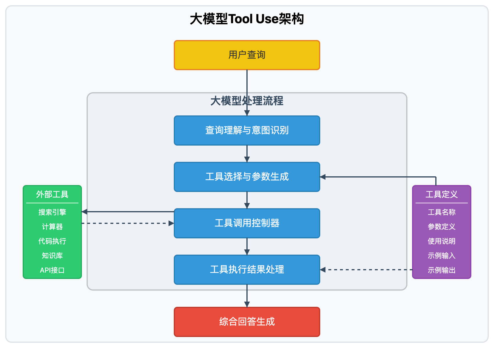
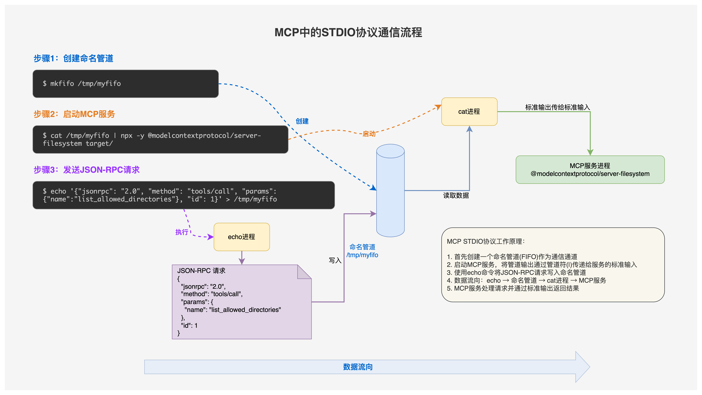

MCP：spring ai examples 的 mcp 示例，fileserver


什么是MCP

为什么要MCP

主要是解决function calling 的问题



怎么解决MCP提出的目前的问题的

MCP架构和核心概念

MCP的协议：消息类型，通信，消息体，生命周期

示例


对协议的理解：

```bash
echo '{"jsonrpc": "2.0", "method": "tools/call", "params": {"name":"list_allowed_directories"}, "id": 1}' | npx -y @modelcontextprotocol/server-filesystem target
```

等同于

```bash
# 创建管道
mkfifo /tmp/myfifo
```

```bash
# 启动服务，管道的标准输出作为该服务的标准输入
cat /tmp/myfifo | npx -y @modelcontextprotocol/server-filesystem target/
```

```bash
# 将请求写入管道
echo '{"jsonrpc": "2.0", "method": "tools/call", "params": {"name":"list_allowed_directories"}, "id": 1}' > /tmp/myfifo
```

 此时 server-filesystem 接收到请求，给出对应的响应

```json
{"result":{"content":[{"type":"text","text":"Allowed directories:\n/xxx/spring-ai-examples/model-context-protocol/filesystem/target"}]},"jsonrpc":"2.0","id":1}
```




https://github.com/wong2/mcp-cli 这是一个比较好的调试 stdio 的 mcp server 的工具


协议的细节：https://spec.modelcontextprotocol.io/specification/2024-11-05/architecture/


所有的 method 见：io.modelcontextprotocol.spec.McpSchema。可以执行一下，看看常规的流程是什么样的


注：7b模型很可能不够用

步骤1: 意图识别，提供tools

```json
{
  "messages": [
    {
      "content": "Can you explain the content of the spring-ai-mcp-overview.txt file?",
      "role": "user"
    }
  ],
  "model": "qwen2.5-coder-7b-instruct",
  "stream": true,
  "temperature": 0.7,
  "tools": [
    {
      "type": "function",
      "function": {
        "description": "Read the complete contents of a file from the file system. Handles various text encodings and provides detailed error messages if the file cannot be read. Use this tool when you need to examine the contents of a single file. Only works within allowed directories.",
        "name": "read_file",
        "parameters": {
          "additionalProperties": false,
          "type": "object",
          "properties": { "path": { "type": "string" } },
          "required": ["path"]
        }
      }
    },
    {
      "type": "function",
      "function": {
        "description": "Read the contents of multiple files simultaneously. This is more efficient than reading files one by one when you need to analyze or compare multiple files. Each file's content is returned with its path as a reference. Failed reads for individual files won't stop the entire operation. Only works within allowed directories.",
        "name": "read_multiple_files",
        "parameters": {
          "additionalProperties": false,
          "type": "object",
          "properties": {
            "paths": { "type": "array", "items": { "type": "string" } }
          },
          "required": ["paths"]
        }
      }
    },
    {
      "type": "function",
      "function": {
        "description": "Create a new file or completely overwrite an existing file with new content. Use with caution as it will overwrite existing files without warning. Handles text content with proper encoding. Only works within allowed directories.",
        "name": "write_file",
        "parameters": {
          "additionalProperties": false,
          "type": "object",
          "properties": {
            "path": { "type": "string" },
            "content": { "type": "string" }
          },
          "required": ["path", "content"]
        }
      }
    },
    {
      "type": "function",
      "function": {
        "description": "Make line-based edits to a text file. Each edit replaces exact line sequences with new content. Returns a git-style diff showing the changes made. Only works within allowed directories.",
        "name": "edit_file",
        "parameters": {
          "additionalProperties": false,
          "type": "object",
          "properties": {
            "path": { "type": "string" },
            "edits": {
              "type": "array",
              "items": {
                "type": "object",
                "properties": {
                  "oldText": {
                    "type": "string",
                    "description": "Text to search for - must match exactly"
                  },
                  "newText": {
                    "type": "string",
                    "description": "Text to replace with"
                  }
                },
                "required": ["oldText", "newText"],
                "additionalProperties": false
              }
            },
            "dryRun": {
              "type": "boolean",
              "default": false,
              "description": "Preview changes using git-style diff format"
            }
          },
          "required": ["path", "edits"]
        }
      }
    },
    {
      "type": "function",
      "function": {
        "description": "Create a new directory or ensure a directory exists. Can create multiple nested directories in one operation. If the directory already exists, this operation will succeed silently. Perfect for setting up directory structures for projects or ensuring required paths exist. Only works within allowed directories.",
        "name": "create_directory",
        "parameters": {
          "additionalProperties": false,
          "type": "object",
          "properties": { "path": { "type": "string" } },
          "required": ["path"]
        }
      }
    },
    {
      "type": "function",
      "function": {
        "description": "Get a detailed listing of all files and directories in a specified path. Results clearly distinguish between files and directories with [FILE] and [DIR] prefixes. This tool is essential for understanding directory structure and finding specific files within a directory. Only works within allowed directories.",
        "name": "list_directory",
        "parameters": {
          "additionalProperties": false,
          "type": "object",
          "properties": { "path": { "type": "string" } },
          "required": ["path"]
        }
      }
    },
    {
      "type": "function",
      "function": {
        "description": "Get a recursive tree view of files and directories as a JSON structure. Each entry includes 'name', 'type' (file/directory), and 'children' for directories. Files have no children array, while directories always have a children array (which may be empty). The output is formatted with 2-space indentation for readability. Only works within allowed directories.",
        "name": "directory_tree",
        "parameters": {
          "additionalProperties": false,
          "type": "object",
          "properties": { "path": { "type": "string" } },
          "required": ["path"]
        }
      }
    },
    {
      "type": "function",
      "function": {
        "description": "Move or rename files and directories. Can move files between directories and rename them in a single operation. If the destination exists, the operation will fail. Works across different directories and can be used for simple renaming within the same directory. Both source and destination must be within allowed directories.",
        "name": "move_file",
        "parameters": {
          "additionalProperties": false,
          "type": "object",
          "properties": {
            "source": { "type": "string" },
            "destination": { "type": "string" }
          },
          "required": ["source", "destination"]
        }
      }
    },
    {
      "type": "function",
      "function": {
        "description": "Recursively search for files and directories matching a pattern. Searches through all subdirectories from the starting path. The search is case-insensitive and matches partial names. Returns full paths to all matching items. Great for finding files when you don't know their exact location. Only searches within allowed directories.",
        "name": "search_files",
        "parameters": {
          "additionalProperties": false,
          "type": "object",
          "properties": {
            "path": { "type": "string" },
            "pattern": { "type": "string" },
            "excludePatterns": {
              "type": "array",
              "items": { "type": "string" },
              "default": []
            }
          },
          "required": ["path", "pattern"]
        }
      }
    },
    {
      "type": "function",
      "function": {
        "description": "Retrieve detailed metadata about a file or directory. Returns comprehensive information including size, creation time, last modified time, permissions, and type. This tool is perfect for understanding file characteristics without reading the actual content. Only works within allowed directories.",
        "name": "get_file_info",
        "parameters": {
          "additionalProperties": false,
          "type": "object",
          "properties": { "path": { "type": "string" } },
          "required": ["path"]
        }
      }
    },
    {
      "type": "function",
      "function": {
        "description": "Returns the list of directories that this server is allowed to access. Use this to understand which directories are available before trying to access files.",
        "name": "list_allowed_directories",
        "parameters": { "type": "object", "properties": {}, "required": [] }
      }
    }
  ]
}

```


大模型返回 tool 的选择，选择了 read file

```json
{
  "choices": [
    {
      "message": {
        "content": "",
        "role": "assistant",
        "tool_calls": [
          {
            "function": {
              "name": "read_file",
              "arguments": "{\"path\": \"spring-ai-mcp-overview.txt\"}"
            },
            "index": 0,
            "id": "call_425f0e02517f494eb1fad6",
            "type": "function"
          }
        ]
      },
      "finish_reason": "tool_calls",
      "index": 0,
      "logprobs": null
    }
  ],
  "object": "chat.completion",
  "usage": {
    "prompt_tokens": 1437,
    "completion_tokens": 47,
    "total_tokens": 1484
  },
  "created": 1741574662,
  "system_fingerprint": null,
  "model": "qwen2.5-coder-32b-instruct",
  "id": "chatcmpl-f8d224df-d92a-933e-bacf-3fb23425cdcb"
}
```


步骤二：找不到文件

```json
{
  "messages": [
    {
      "content": "Can you explain the content of the spring-ai-mcp-overview.txt file?",
      "role": "user"
    },
    {
      "content": "",
      "role": "assistant",
      "tool_calls": [
        {
          "id": "call_425f0e02517f494eb1fad6",
          "type": "function",
          "function": {
            "name": "read_file",
            "arguments": "{\"path\": \"spring-ai-mcp-overview.txt\"}"
          }
        }
      ]
    },
    {
      "content": "[{\"type\":\"text\",\"text\":\"Error: Access denied - path outside allowed directories: /Users/haidao/IdeaProjects/study/spring-ai-examples/model-context-protocol/filesystem/spring-ai-mcp-overview.txt not in /Users/haidao/IdeaProjects/study/spring-ai-examples/model-context-protocol/filesystem/target\"}]",
      "role": "tool",
      "name": "read_file",
      "tool_call_id": "call_425f0e02517f494eb1fad6"
    }
  ],
  "model": "qwen2.5-coder-32b-instruct",
  "stream": false,
  "temperature": 0.7,
  "tools": [{},{}]
}

```

大模型选择使用list_allowed_directories来查找

```json
{
  "choices": [
    {
      "message": {
        "content": "It seems like there was an error accessing the file. The file path provided is outside the allowed directories. Please provide a correct path within the allowed directories to read the file.",
        "role": "assistant",
        "tool_calls": [
          {
            "function": {
              "name": "list_allowed_directories",
              "arguments": "{}"
            },
            "index": 0,
            "id": "call_c371c69e620c4e5f87982f",
            "type": "function"
          }
        ]
      },
      "finish_reason": "tool_calls",
      "index": 0,
      "logprobs": null
    }
  ],
  "object": "chat.completion",
  "usage": {
    "prompt_tokens": 1543,
    "completion_tokens": 50,
    "total_tokens": 1593
  },
  "created": 1741574663,
  "system_fingerprint": null,
  "model": "qwen2.5-coder-32b-instruct",
  "id": "chatcmpl-15c3324e-1f7e-9b37-aa86-2437a6364966"
}

```

步骤三：大模型调用list_allowed_directories这个function，得到输出

```json
{
  "messages": [
    {
      "content": "Can you explain the content of the spring-ai-mcp-overview.txt file?",
      "role": "user"
    },
    {
      "content": "",
      "role": "assistant",
      "tool_calls": [
        {
          "id": "call_425f0e02517f494eb1fad6",
          "type": "function",
          "function": {
            "name": "read_file",
            "arguments": "{\"path\": \"spring-ai-mcp-overview.txt\"}"
          }
        }
      ]
    },
    {
      "content": "[{\"type\":\"text\",\"text\":\"Error: Access denied - path outside allowed directories: /Users/haidao/IdeaProjects/study/spring-ai-examples/model-context-protocol/filesystem/spring-ai-mcp-overview.txt not in /Users/haidao/IdeaProjects/study/spring-ai-examples/model-context-protocol/filesystem/target\"}]",
      "role": "tool",
      "name": "read_file",
      "tool_call_id": "call_425f0e02517f494eb1fad6"
    },
    {
      "content": "It seems like there was an error accessing the file. The file path provided is outside the allowed directories. Please provide a correct path within the allowed directories to read the file.",
      "role": "assistant",
      "tool_calls": [
        {
          "id": "call_c371c69e620c4e5f87982f",
          "type": "function",
          "function": { "name": "list_allowed_directories", "arguments": "{}" }
        }
      ]
    },
    {
      "content": "[{\"type\":\"text\",\"text\":\"Allowed directories:\\n/Users/haidao/IdeaProjects/study/spring-ai-examples/model-context-protocol/filesystem/target\"}]",
      "role": "tool",
      "name": "list_allowed_directories",
      "tool_call_id": "call_c371c69e620c4e5f87982f"
    }
  ],
  "model": "qwen2.5-coder-32b-instruct",
  "stream": false,
  "temperature": 0.7,
  "tools": [{},{}]
}
```

找到了文件，接下来应该调用read_file读取文件内容

```json
{
  "choices": [
    {
      "message": {
        "content": "The allowed directory is `/Users/haidao/IdeaProjects/study/spring-ai-examples/model-context-protocol/filesystem/target`. Please ensure the file `spring-ai-mcp-overview.txt` is located within this directory or provide the correct path.\n\nIf the file is indeed in the `target` directory, please try again with the correct path:",
        "role": "assistant",
        "tool_calls": [
          {
            "function": {
              "name": "read_file",
              "arguments": "{\"path\": \"target/spring-ai-mcp-overview.txt\"}"
            },
            "index": 0,
            "id": "call_af5b08181b764ddea3a219",
            "type": "function"
          }
        ]
      },
      "finish_reason": "tool_calls",
      "index": 0,
      "logprobs": null
    }
  ],
  "object": "chat.completion",
  "usage": {
    "prompt_tokens": 1635,
    "completion_tokens": 100,
    "total_tokens": 1735
  },
  "created": 1741574667,
  "system_fingerprint": null,
  "model": "qwen2.5-coder-32b-instruct",
  "id": "chatcmpl-77c5295e-8995-9a03-987e-0cd216de19e0"
}

```

步骤四：通过mcp读到了文件内容，注意文件内容是一个结构化的结果，是一个数组。

```json
{
  "messages": [
    {
      "content": "Can you explain the content of the spring-ai-mcp-overview.txt file?",
      "role": "user"
    },
    {
      "content": "",
      "role": "assistant",
      "tool_calls": [
        {
          "id": "call_425f0e02517f494eb1fad6",
          "type": "function",
          "function": {
            "name": "read_file",
            "arguments": "{\"path\": \"spring-ai-mcp-overview.txt\"}"
          }
        }
      ]
    },
    {
      "content": "[{\"type\":\"text\",\"text\":\"Error: Access denied - path outside allowed directories: /Users/haidao/IdeaProjects/study/spring-ai-examples/model-context-protocol/filesystem/spring-ai-mcp-overview.txt not in /Users/haidao/IdeaProjects/study/spring-ai-examples/model-context-protocol/filesystem/target\"}]",
      "role": "tool",
      "name": "read_file",
      "tool_call_id": "call_425f0e02517f494eb1fad6"
    },
    {
      "content": "It seems like there was an error accessing the file. The file path provided is outside the allowed directories. Please provide a correct path within the allowed directories to read the file.",
      "role": "assistant",
      "tool_calls": [
        {
          "id": "call_c371c69e620c4e5f87982f",
          "type": "function",
          "function": { "name": "list_allowed_directories", "arguments": "{}" }
        }
      ]
    },
    {
      "content": "[{\"type\":\"text\",\"text\":\"Allowed directories:\\n/Users/haidao/IdeaProjects/study/spring-ai-examples/model-context-protocol/filesystem/target\"}]",
      "role": "tool",
      "name": "list_allowed_directories",
      "tool_call_id": "call_c371c69e620c4e5f87982f"
    },
    {
      "content": "The allowed directory is `/Users/haidao/IdeaProjects/study/spring-ai-examples/model-context-protocol/filesystem/target`. Please ensure the file `spring-ai-mcp-overview.txt` is located within this directory or provide the correct path.\n\nIf the file is indeed in the `target` directory, please try again with the correct path:",
      "role": "assistant",
      "tool_calls": [
        {
          "id": "call_af5b08181b764ddea3a219",
          "type": "function",
          "function": {
            "name": "read_file",
            "arguments": "{\"path\": \"target/spring-ai-mcp-overview.txt\"}"
          }
        }
      ]
    },
    {
      "content": "[{\"type\":\"text\",\"text\":\"\\nModel Context Protocol (MCP) Java SDK\\n\\nA Java implementation of the Model Context Protocol specification, providing both synchronous and \\nasynchronous clients for MCP server interactions.\\n\\nOverview: This SDK implements the Model Context Protocol, enabling seamless integration with AI models and tools through \\na standardized interface. It supports both synchronous and asynchronous communication patterns, making it suitable for \\nvarious use cases and integration scenarios.\\n\\nFeatures\\n\\n Synchronous and Asynchronous client implementations\\n Standard MCP operations support:\\n\\t Tool discovery and execution\\n\\t Resource management and templates\\n\\t Prompt handling and management\\n\\t Resource subscription system\\n\\t Server initialization and ping\\n Stdio-based server transport\\n Reactive programming support using Project Reactor\\n\\n\"}]",
      "role": "tool",
      "name": "read_file",
      "tool_call_id": "call_af5b08181b764ddea3a219"
    }
  ],
  "model": "qwen2.5-coder-32b-instruct",
  "stream": false,
  "temperature": 0.7,
  "tools": [{},{}]
}

```

大模型解析读到的文件内容，看起来大模型对于 'explain the content of the spring-ai-mcp-overview.txt file' 的理解就是返回其内容

```json
{
  "choices": [
    {
      "message": {
        "content": "The content of the `spring-ai-mcp-overview.txt` file is as follows:\n\n```\nModel Context Protocol (MCP) Java SDK\n\nA Java implementation of the Model Context Protocol specification, providing both synchronous and \nasynchronous clients for MCP server interactions.\n\nOverview: This SDK implements the Model Context Protocol, enabling seamless integration with AI models and tools through \na standardized interface. It supports both synchronous and asynchronous communication patterns, making it suitable for \nvarious use cases and integration scenarios.\n\nFeatures\n\n Synchronous and Asynchronous client implementations\n Standard MCP operations support:\n\t Tool discovery and execution\n\t Resource management and templates\n\t Prompt handling and management\n\t Resource subscription system\n\t Server initialization and ping\n Stdio-based server transport\n Reactive programming support using Project Reactor\n```",
        "role": "assistant"
      },
      "finish_reason": "stop",
      "index": 0,
      "logprobs": null
    }
  ],
  "object": "chat.completion",
  "usage": {
    "prompt_tokens": 1899,
    "completion_tokens": 160,
    "total_tokens": 2059
  },
  "created": 1741574671,
  "system_fingerprint": null,
  "model": "qwen2.5-coder-32b-instruct",
  "id": "chatcmpl-48a7eaa6-f2dc-91f1-b46b-6053c6a8bf8d"
}

```


生态：

见https://github.com/modelcontextprotocol/servers?tab=readme-ov-file#-resources，如 

1. https://mcp-get.com/
2. cli
3. https://github.com/supercorp-ai/supergateway  把 stdio 的 mcp server 包装成 sse 的
