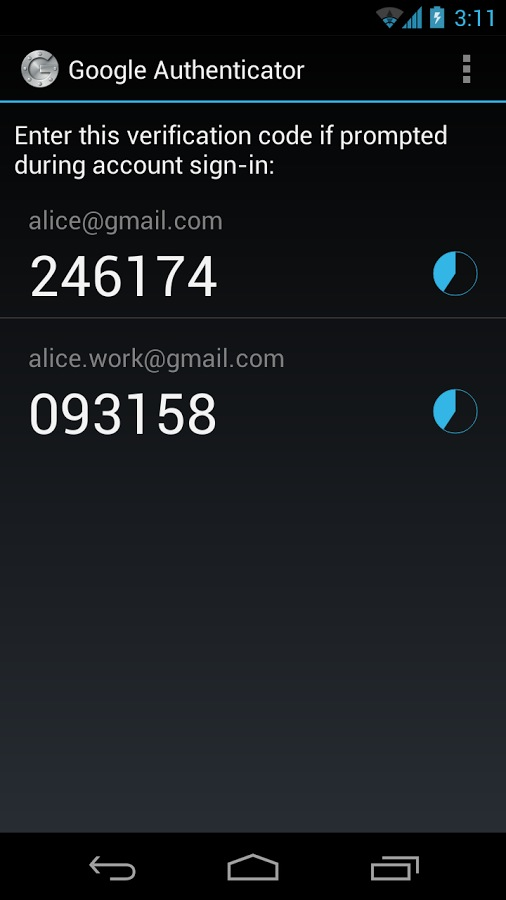

在业务中，为安全起见，常常需要二次验证。其流程一般为，密码验证之后，需要再次输入一个一次性的密码（一般为位数较短的数字），才能完成验证。二次验证一般需要同时验证设备的唯一性。

从验证方式上看，二次验证可以通过短信验证或 APP 验证（Google Authenticator）。对于短信验证，优点是操作方便，不需安装额外的 APP；缺点是实时性较差，依赖短信，有被窃听的风险。APP 方式正好相反。

以此来看，在业务初期，宜使用短信验证方式，减少用户输入的复杂度。待用户量和用户黏度上去之后可以考虑换用 APP 验证。毕竟，在已经安装 APP 的情况下，这种方式更加便捷和安全。

OTP（one time password），即一次性验证密码，也称动态口令。一次性密码的产生方式，主要是以时间差做为服务器与密码产生器的同步条件。在需要登录的时候，就利用密码产生器产生一次性密码，OTP一般分为计次使用（HOTP）以及计时使用（TOTP）两种，计次使用的OTP产出后，可在不限时间内使用；计时使用的OTP则可设定密码有效时间，从30秒到两分钟不等，而OTP在进行认证之后即废弃不用，下次认证必须使用新的密码，增加了试图不经授权存取有限制资源的难度[^1]。

Google Authenticator 的二次验证也是使用的OTP。其核心原理是：服务器和客户端（一般是 `Google Authenticator` app）保存同一份密钥，客户端根据该密钥和当前时间戳计算得到6位数字，发到服务器，服务器根据同样的算法得到6位数字。做比较之后判断客户端传来的数字是否合法。详述如下[^2]：

对于 HOTP，客户端和服务器事先协商好一个密钥 K，用于一次性密码的生成过程，此密钥不被任何第三方所知道。此外，客户端和服务器各有一个计数器 C，并且事先将计数值同步。

进行验证时，客户端对密钥和计数器的组合(K,C)使用HMAC（Hash-based Message Authentication Code）算法计算一次性密码，公式如下：

$$HOTP(K,C) = Truncate(HMAC\\_SHA1(K,C))$$

经过截断，得到的 OTP 一般是 6 位数，用户将得到的 OTP 发送到服务器，服务器端经过同样的验证，验证成功则计数器加 1。

TOTP 将 HOTP 中的计数器 C 用当前时间来替代，于是就得到了随着时间变化的一次性密码。也就是说，当给定密钥之后，每一时刻的 OTP 都是固定不变的（假设间隔时间固定为 T）。

这里需要稍加注意的地方是间隔时间的选择，不能太长，否则安全性不能保证；也不能太短，否则用户无法及时验证。Google 的选择是 30 秒。当我们使用 Google Authenticator 验证时，因为 OTP 的获得没有延迟，因此 30 秒是个比较合理的数字；如果我们想要通过短信进行验证，考虑到短信推送的延迟和用户读取的延迟，30 秒的时间可能有点短。通常情况下短信验证的有效时间在 1 分钟到 2 分钟之间，这是一个比较合理的数字。

TOTP 还有个边界问题，如下图所示。当在 OA 时刻发起短信验证请求，在理想情况下，我们只有在 OA 时间段发起验证，验证才能成功。也就是说，用户的有效输入时间在 T（当发起时刻靠近 O 时）到 0 之间（当发起时刻靠近 A），也就是说，用户有一定的概率验证几乎必然失败（发起时刻靠近 A，考虑到 OTP 获取延迟和用户输入延迟），这显然是不合理的。

可以通过在验证时刻验证当前时刻以及前 N 个时间片来解决这个问题。如图所示，我们验证当前时刻和前一时刻，当在 OA 时间片发起验证时，验证区间是 OB 段，这样用户的有效输入时间就是 T~2T，如果我们取 T 为 1 分钟，这会是一个比较合理的结果。

真实情况下还要考虑客户端和服务器的时钟偏差，不再赘述。（如果使用短信验证，基本不存在这个问题，因为发起验证的 OTP 也是由服务器产生的。）

[^1]: http://zh.wikipedia.org/wiki/%E4%B8%80%E6%AC%A1%E6%80%A7%E5%AF%86%E7%A2%BC

[^2]: http://blog.seetee.me/archives/73.html

